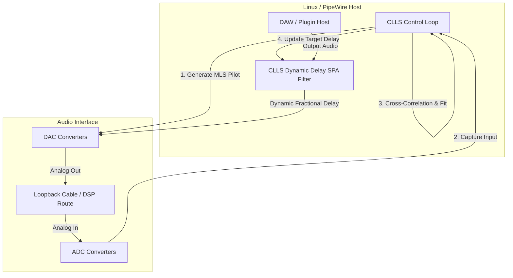

# Arthur: Closed-Loop Latency Sync (CLLS) Design

This document details the architecture and implementation design for a real-time, closed-loop hardware latency measurement and compensation engine built on top of PipeWire. It utilizes hardware loopback as a temporal "wordclock," ensuring absolute sample-accurate synchronization and zero latency drift.

---

## 1. The Problem: Clock Drift & USB Packet Jitter

In professional audio production, DAWs and OS audio servers (ALSA, CoreAudio, ASIO) rely on **static latency reporting**. The audio interface driver tells the OS: *"My round-trip converter latency is exactly 128 samples."* 

However, in reality:
* **USB Clock Drift:** The host computer's CPU clock and the audio interface's DAC/ADC word clock operate on separate physical crystal oscillators. Without a shared physical wordclock cable, they drift relative to each other (typically by 10 to 50 parts per million). This means the time between software buffer submission and physical DAC conversion drifts over time.
* **USB packet scheduling jitter:** Under Linux, the USB audio driver (`snd-usb-audio`) schedules packets. Depending on the CPU's current C-state, kernel scheduler load, and thread wake-ups, the audio buffer might be submitted to the USB controller slightly earlier or later within a USB frame (125 microseconds for USB High Speed).
* **Converter Startup Variations:** Delta-sigma DAC/ADC chips initialize their digital decimation/interpolation filters upon power-on or sample rate changes. The alignment of these filters to the clock edge can vary by 8 to 32 samples on every device reset or sample-rate switch.

This causes phase misalignment when multi-tracking or using external hardware inserts, leading to comb filtering and phase cancellation.

---

## 2. The CLLS Solution (Closed-Loop Measurement)

CLLS continuously measures the physical round-trip time (RTT) of the audio hardware in the background and dynamically applies a micro-delay to align the input and output streams.



### Technical Implementation

### A. The Pilot Signal (Maximum Length Sequence - MLS)
To measure latency continuously without interfering with the engineer:
1. **Dedicated Loopback Channel:** Most modern class-compliant USB audio interfaces have a dedicated loopback channel (e.g., Channels 7-8). Since these channels are not routed to the main monitors (Channels 1-2) or headphone outputs, we can play a high-level pseudo-random MLS sequence (e.g. at -20 dBFS) through this loopback path.
2. **Ultrasonic Tones (Shared Channels):** If a dedicated loopback is unavailable, we can inject an ultrasonic pilot tone (e.g. at 21.5 kHz) on the main channels. Since this is above the human hearing threshold, it is inaudible but can be captured by the interface's ADC.

### B. High-Precision Cross-Correlation
The CLLS engine reads the captured loopback input and correlates it against the transmitted MLS sequence:
1. **Circular Cross-Correlation:** Computes the sliding dot product between the received signal $y(n)$ and the reference MLS $x(n)$.
2. **Sinc-Interpolated Peak Detection:** Since the MLS sequence is band-limited by the converter's anti-aliasing filters, the correlation peak has a sinc-like shape rather than a pure mathematical delta. We locate the integer peak index $p$, and perform parabolic or windowed-sinc interpolation on the surrounding points ($p-1, p, p+1$) to determine the exact delay down to a fraction of a sample:
   $$\delta = \frac{corr(p-1) - corr(p+1)}{2(corr(p-1) - 2corr(p) + corr(p+1))}$$
   This yields sub-sample precision (resolution $< 100$ nanoseconds).

### C. Dynamic Delay-Locked Loop (DLL)
Once the actual physical latency $L(t)$ is measured, the system applies a dynamic delay $D(t)$ to the recording/processing path to maintain a constant target latency $T$ (where $T > L_{max}$):
$$D(t) = T - L(t)$$

To apply this fractional delay in real-time without introducing audible pitch-shifting or clicking:
* **Farrow Structure Filter:** We implement a fractional delay line using a 3rd-order Lagrange interpolator implemented as a Farrow structure. This structure separates the fractional delay parameter $d$ from the filter coefficients, allowing sample-by-sample adjustments.
* **Low-Pass Smoothing:** The delay adjustment is smoothed using a PI (Proportional-Integral) loop controller. Since clock drift is extremely slow ($10^{-5}$ seconds per second), the rate of delay change is tiny, keeping any dynamic frequency modulation (Doppler shift) completely below the threshold of human perception ($< 0.001$ cents).

---

## 3. PipeWire SPA Module Architecture

Rather than running as an external application, CLLS is best implemented as a native **PipeWire SPA (Simple Plugin API) Filter Node**. 

### SPA Node Integration
We can build `libpipewire-module-clls` which exposes an audio filter node:
1. **Ports:**
   * `in_loopback`: Captures the return signal from the hardware interface.
   * `out_loopback`: Outputs the MLS pilot tone.
   * `in_audio_N`: Main inputs from the physical microphone/line preamps.
   * `out_audio_N`: Aligned inputs routed to the DAW.
2. **Process Loop:**
   * The `process` callback is triggered by PipeWire's graph scheduler.
   * It writes the next block of the MLS pilot to `out_loopback`.
   * It reads the loopback signal from `in_loopback` and feeds the background correlation thread.
   * For the main audio paths (`in_audio_N`), it processes the sample buffer through the Farrow fractional delay line, adjusting the delay $d$ towards the target $D(t)$.

```
   [Physical Input] ---> [CLLS SPA Filter (Farrow Delay)] ---> [DAW Track Input]
                                   ▲
                             Control Loop
                                   │
   [Loopback Output] <--- [MLS Pilot Generator]
   [Loopback Input]  ---> [Cross-Correlation Engine]
```

---

## 4. Audio-MIDI Clock Unification

Because USB MIDI and USB Audio typically run on different software and hardware clocks, they suffer from two major issues:
1. **Clock Drift:** The MIDI clock reference (usually the host CPU's `CLOCK_MONOTONIC`) and the audio converter's sample clock drift relative to each other over time.
2. **Packet Jitter:** MIDI events sent over USB are packetized and transmitted asynchronously. Operating system scheduler wakeups introduce 1–8ms of random timing jitter by the time the event reaches the DAW.

### Unified Timing Solution

Since both USB Audio and USB MIDI packets share the same physical USB controller and host controller clock (e.g., the 125-microsecond High-Speed USB microframes), we can link them at the PipeWire/ALSA driver level using the CLLS timebase:

1. **Jitter-Free MIDI Timestamping & PCM Slaving (Incoming):**
   Standard USB MIDI events are timestamped by the kernel when they are read into user-space, which is heavily affected by CPU scheduling delays. To bypass this, we configure the **ALSA Sequencer Queue** to slave its master timer directly to the audio interface's **PCM hardware audio clock** (e.g. using `snd_seq_queue_timer` slaved to `hw:X,Y`).
   * **Kernel-Level Sample Stamping:** When a USB MIDI message arrives at the USB controller, the kernel interrupt handler immediately stamps the event using the current sample counter of the slaved PCM audio queue.
   * **CPU Load Immunity:** Because this timestamping happens in the kernel interrupt context, it is completely immune to user-space thread delays, CPU load spikes, or DAW processing load.
   * **Dynamic Alignment:** Even if the DAW's audio callback is delayed by several milliseconds due to a high CPU load, the MIDI events are delivered with their raw, PCM-locked sample offsets. The DAW is forced to place the notes on the timeline at the exact physical moment they arrived at the USB bus, eliminating CPU-dependent note-placement jitter.

2. **Pre-Compensated Hardware Synth Sync (Outgoing MIDI Clock):**
   When sending MIDI note and clock data to external hardware synthesizers, the DAW expects the synth's generated audio to return perfectly on-grid.
   * If the measured audio RTT is $L(t)$ samples, we schedule the outgoing MIDI messages to be sent exactly $L(t)$ samples *early* relative to the playhead.
   * Because the latency compensation $L(t)$ updates dynamically in real-time, the external synth's audio output returns to the DAW inputs perfectly phase-locked to the DAW's grid, regardless of clock drift or USB jitter.

---

## 5. Phase-Locked Multi-Device Aggregation

When combining multiple physical USB audio devices (e.g. using PipeWire's `module-combine-stream` or `alsa_in`/`alsa_out`), the devices run on separate physical crystal oscillators. Without a shared physical Wordclock cable, their sample clocks run at slightly different frequencies, causing buffer drift, underflows/overflows, and phase misalignment.

### The Problem with Adaptive Resampling
PipeWire solves buffer underflows by applying **adaptive resampling** in the background to match clock rates. However:
1. Adaptive resampling only matches the **frequency** of the devices to keep buffers from overflowing or underflowing.
2. It does **not** align the **absolute physical phase** of the AD/DA converters.
3. Every time the combined stream starts, the two devices will have an arbitrary, random phase offset (e.g. Device B is delayed by 14.2 samples relative to Device A), which can jump when streams restart. This makes multi-device aggregation unusable for phase-sensitive tasks like multi-mic recording (comb filtering).

### The CLLS Software-Based Wordclock

CLLS provides a **software-based phase-locked loop** for multi-device aggregation:

1. **Adaptive Resampling (Frequency Lock):** We let PipeWire's standard resampler match the clock rates of Device A and Device B to establish a common logical frequency base.
2. **CLLS Dual Calibration (Phase Lock):** We run the CLLS loopback measurement on *both* devices:
   * Device A's loopback measures its real-time physical latency $L_A(t)$ samples.
   * Device B's loopback measures its real-time physical latency $L_B(t)$ samples.
3. **Common Target Alignment:** We define a common target latency $T$ (where $T > \max(L_A, L_B)$).
4. **Independent Fractional Delay Lines:** We apply separate Farrow fractional delay lines to the physical ports of each device:
   * Device A's ports are delayed by $D_A(t) = T - L_A(t)$
   * Device B's ports are delayed by $D_B(t) = T - L_B(t)$

This projects both audio streams onto the exact same virtual time horizon $T$. When you record a source using a microphone on Device A and another on Device B, **their waveforms are aligned sample-accurately in the DAW timeline, completely eliminating phase drift and startup alignment variations.** This replicates the stability of a hardware Wordclock network purely in software.

---

## 6. Key Benefits of CLLS

1. **Phase-Locked Multi-Mic Arrays:** If you record a drum kit with 8 microphones, any subtle clock drift or converter startup differences between daisy-chained or multi-device setups can alter the phase alignment between mics. CLLS locks them to sub-nanosecond phase alignment.
2. **Deterministic Hardware Inserts:** When using external analog outboard gear (e.g. compressors, EQs) as inserts, the DAW's round-trip latency compensation must be exact to avoid phase offset. CLLS makes external hardware inserts perform identically across reboots and sample rate changes.
3. **Software-Based Wordclock Aggregation:** Allows combining multiple independent USB audio interfaces into a single aggregate device with absolute sample-accurate phase locking, bypassing the need for physical Wordclock BNC cables.
4. **Drift-Free Network/Wireless Audio:** If routing audio over a network (e.g., AVB, Ravenna, or local Wi-Fi/Bluetooth), CLLS dynamically tracks and eliminates the massive network packet jitter, making the network interface behave like a local physical soundcard.
5. **Jitter-Free MIDI Integration:** By locking MIDI packet scheduling directly to the physical audio converter clock, input key tracking and external hardware synthesizer loops are freed from USB scheduling drift and jitter.
6. **Visual Latency Monitor:** Provides a real-time diagnostics dashboard:
   ```
   === CLLS Latency Engine Status ===
   Device: Focusrite Scarlett 18i20 (USB Class Compliant)
   Target Latency: 256.00 samples (5.333 ms @ 48kHz)
   Measured RTT:   242.34 samples (5.048 ms)
   Compensation:   +13.66 samples (0.285 ms)
   Phase Jitter:   ±0.02 samples (±416 ns)
   Status:         Locked (Phase-Aligned)
   ```
